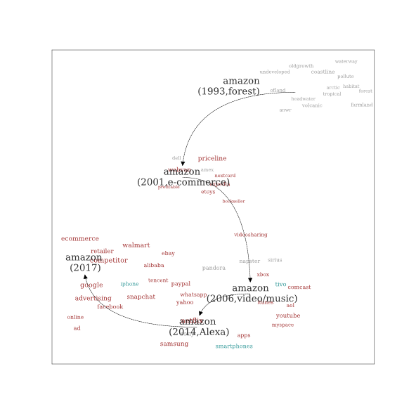
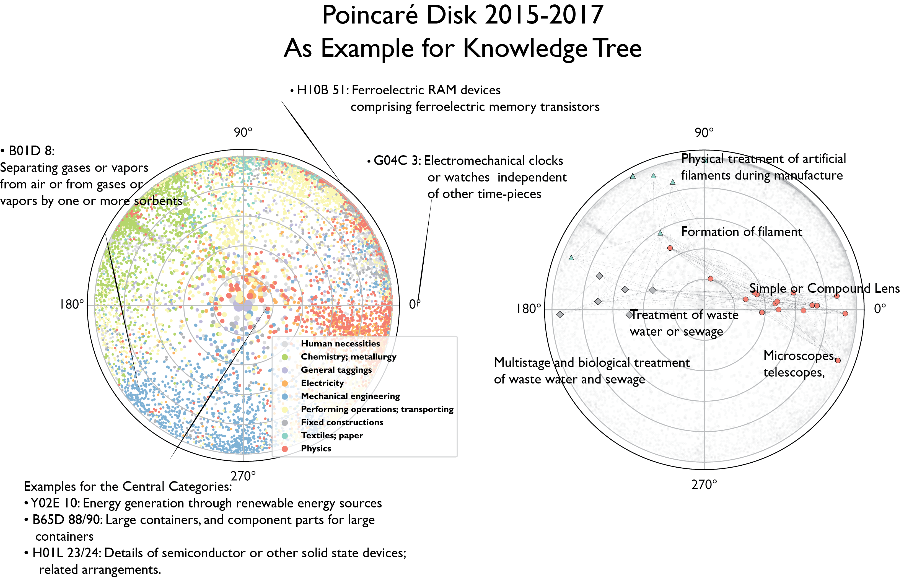
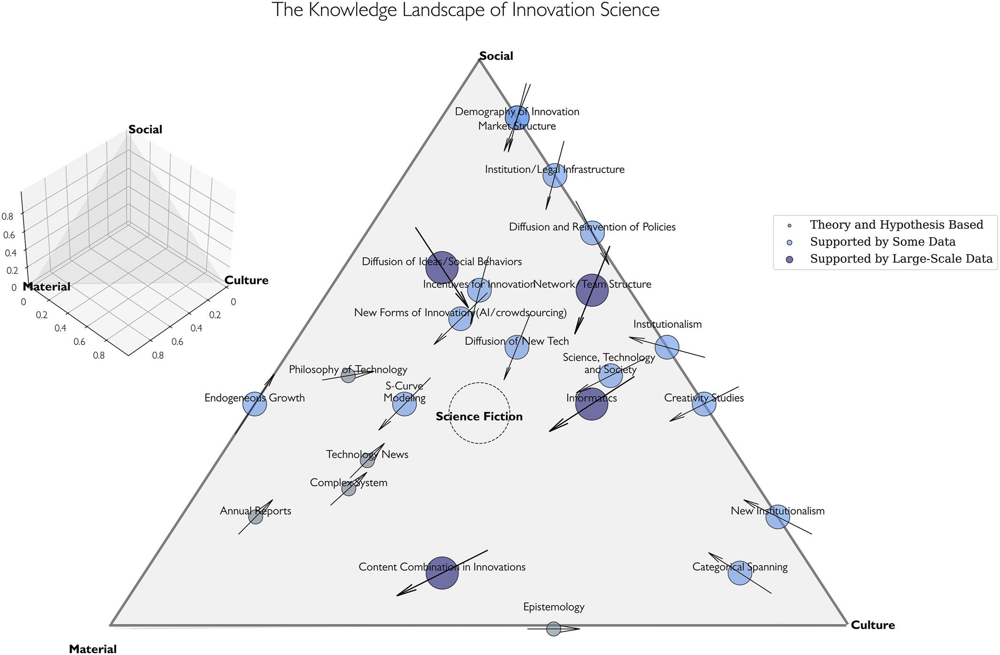
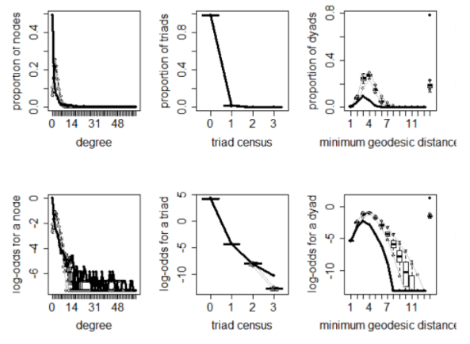

Combinatorial Innovation in Business and Technology
------

|  {:height="300px" width="300px"} | In <strong>Higher Order Innovation and New Venture Success</strong>, we use dynamic word embeddings and other NLP techniques to trace the change of business environment for U.S. companies in the past 45 years. We use over 100 business publications and patent corpus to build a model for the dynamic business landscape, which contains rich information about potential commercial opportunities and relational business concepts. The outcome is a multi-slice embedding space, with each slice reflects the underlying economic reality and Zeitgeist of the time. *Cao, L., Chen, Z., & Evans, J. Novelty and New Venture Success. Drafting.*| 
| {:height="300px" width="300px"}| In <strong>Subjective Objectivity in the Innovative Space</strong>, we measure the subjective intellectual micro-environments for each inventor/writer/entrepreneur, testify the sociological theory of ideology formation, and show how computational social science can contribute to philosophy and sociology theory in a creative way.  *Cao, L., Pan, R., & Evans, J. Subjective Objectivity: The Possibilities for Innovation in a Dynamic Space. Data Analysis.* | 
| {:height="120px" width="300px"}| In <strong>Rethinking Recombination Dimension for Technological Innovation</strong>, we apply Poincaré embedding algorithm on U.S. patent data to trace the evolution of AI technologies from 2001-2015.  *Cao, L., Evans, J. Rethinking Wide Recombination in Technological Innovations: How does Recombination Dimension Matter in Technological Breakthrough?. Drafting.* | 
| {:height="300px" width="300px"}| In <strong>The Paradox of Innovation Science</strong>, we coin 'destructive creation' to focus the vast, fragmented research on how innovation emerges from discord and disorder, at large scales and small. We highlight new data-driven opportunities to understand and surf this critical boundary between order and chaos.  [Sociology Compass (2022)](https://compass.onlinelibrary.wiley.com/doi/full/10.1111/soc4.13043)| 

Co-Evolution of Knowledge and the Structure of Business Communities
------

|  {:height="250px" width="300px"}| In <strong> Evolution of Venture Capital Networks in China</strong>, we use ERGM and other models in SNA (social network analysis) to explore the pattern of network evolution in Chinese Venture Capital (VC) industry. We are interested in (1) how do VC firms choose their partners? And (2) how does this choice influence their long-term development?   This is a team project with researchers from Tsinghua University.   *[Jiangsu Social Sciences (2018, in Chinese)](http://socialbigdata.cn/css/team/doc/luo/%E5%B5%8C%E5%85%A5%E6%80%A7%E5%A6%82%E4%BD%95%E5%BD%B1%E5%93%8DVC%E9%97%B4%E7%9A%84%E8%81%94%E5%90%88%E6%8A%95%E8%B5%84_%E7%BD%97%E5%AE%B6%E5%BE%B7.pdf)* 　&nbsp; 　&nbsp; 　&nbsp; *[Management and Organization Review (2022)](https://www.cambridge.org/core/journals/management-and-organization-review/article/how-venture-capital-firms-choose-syndication-partners-the-moderating-effects-of-institutional-uncertainty-and-investment-preference/890DDCFD04F3EF14BB350ED1602193CF)* |
| {:height="300px" width="300px"}|In <strong>the Knowldge Landscape and Strategic Decision Making of New Ventures</strong>, we apply NK model to simulate the strategic search of new ventures on a rugged landscape and see how knowledge expertise and competition shape the positioning decisions of new ventures.  *Cao, L., Zhong, Q. Data Mining.* | 