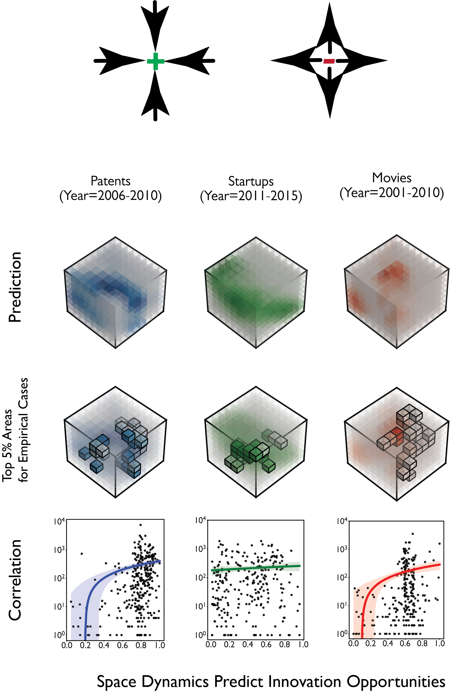
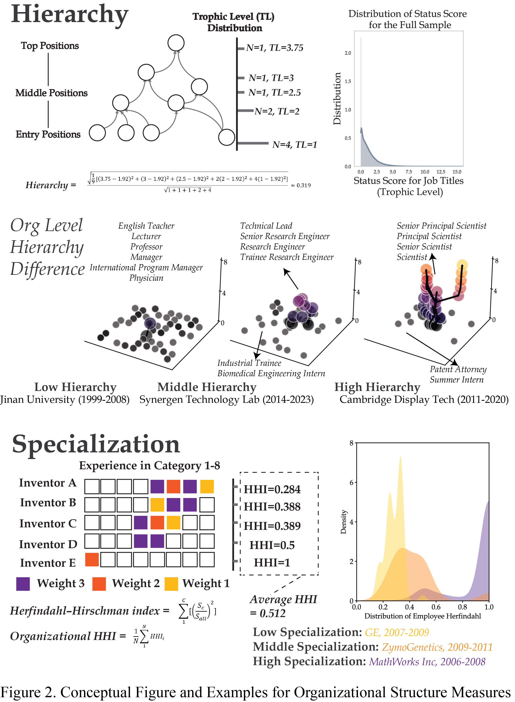
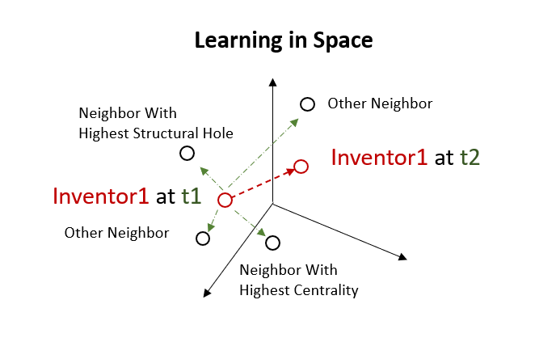
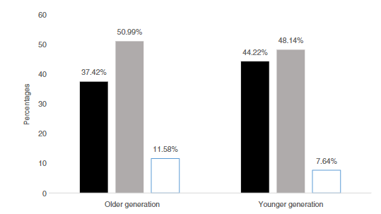

Combinatorial Innovation in Business and Technology
------

| {:height="300px" width="300px"}| In <strong>The Geometry of Perspective</strong>, we measure the subjective intellectual micro-environments for each inventor/writer/entrepreneur, testify the sociological theory of ideology formation, and show how computational social science can contribute to philosophy and sociology theory in a creative way.  *Cao, L., Pan, R., & Evans, J. The Geometry of Perspective: Predicting Personal Innovation with Dynamic Models of Subjectivity. Drafting. (ASA 2023)* | 
|  {:height="300px" width="300px"} | In <strong>Higher Order Innovation and New Venture Success</strong>, we use dynamic word embeddings and other NLP techniques to trace the change of business environment for U.S. companies in the past 45 years. We use over 100 business publications and patent corpus to build a model for the dynamic business landscape, which contains rich information about potential commercial opportunities and relational business concepts. The outcome is a multi-slice embedding space, with each slice reflects the underlying economic reality and Zeitgeist of the time. *Cao, L., Chen, Z., & Evans, J. Novelty and New Venture Success. Submitted. (ASA 2021, IC2S2 2022, AOM 2023)  *[Arxiv](https://arxiv.org/abs/2405.15042)* | 
| {:height="120px" width="300px"}| In <strong>Depth versus Breadth in the Hierarchical Recombination of Technology</strong>, we apply Poincaré embedding algorithm on U.S. patent data to trace the evolution of AI technologies from 2001-2015.  *Cao, L., Evans, J. Depth versus Breadth in the Hierarchical Recombination of Technology. Submitted. (ASA 2023, ICSSI 2023)* | 
| {:height="300px" width="300px"}| In <strong>The Paradox of Innovation Science</strong>, we coin 'destructive creation' to focus the vast, fragmented research on how innovation emerges from discord and disorder, at large scales and small. We highlight new data-driven opportunities to understand and surf this critical boundary between order and chaos.  *[Sociology Compass (2022)](https://compass.onlinelibrary.wiley.com/doi/full/10.1111/soc4.13043)*| 

Co-Evolution of Knowledge and Social Structures
------

| {:height="300px" width="300px"}|In <strong>Unraveling the Interplay Between Formal Organizational Structures and Networks in Career Advancement</strong>, we explore how formal organizational structures set contexts for social network effects. We test this hypothesis in knowledge workers' career trajectories, based on a unique dataset compiled from US patents application history and millions of Linkedin records.   This is a team project with scholars from Harvard Business School.   *Cao, L., Zhang, L. & Evans, J. Drafting.* | 
| {:height="300px" width="300px"}|In <strong>Comparing Social Learning Strategies in Collective Search</strong>, we build on recent work on NK models and cultural evolution to understand how groups improve their performance through social learning strategies in a rugged landscape. We model the indirectly-biased network learning strategies, based on social network theories, and then validate the results of the simulation model with empirical data.   *Zhong, Q., Cao, L. Data Analysis. (IC2S2 2023)* | 
| {:height="250px" width="300px"}| In <strong> Evolution of Venture Capital Networks in China</strong>, we use ERGM and other models in social network analysis to explore the pattern of network evolution in Chinese Venture Capital (VC) industry. We are interested in (1) how do VC firms choose their partners? And (2) how does this choice influence their long-term development?   This is a team project with scholars from Tsinghua University.   *[Jiangsu Social Sciences (2018, in Chinese)](http://socialbigdata.cn/css/team/doc/luo/%E5%B5%8C%E5%85%A5%E6%80%A7%E5%A6%82%E4%BD%95%E5%BD%B1%E5%93%8DVC%E9%97%B4%E7%9A%84%E8%81%94%E5%90%88%E6%8A%95%E8%B5%84_%E7%BD%97%E5%AE%B6%E5%BE%B7.pdf)* 　&nbsp; 　&nbsp; 　&nbsp; *[Management and Organization Review (2022)](https://www.cambridge.org/core/journals/management-and-organization-review/article/how-venture-capital-firms-choose-syndication-partners-the-moderating-effects-of-institutional-uncertainty-and-investment-preference/890DDCFD04F3EF14BB350ED1602193CF)* 　&nbsp; 　&nbsp; 　&nbsp; *[Journal of Social Computing (2023)](https://ieeexplore.ieee.org/abstract/document/10241349)* |
| {:height="200px" width="300px"}| In <strong> Making Modernity in China </strong>, we collect first hand survey data to explore employment and entrepreneurship among the new generation of peasant workers in China.   *[Japanese Journal of Sociology (2018)](https://onlinelibrary.wiley.com/doi/full/10.1111/ijjs.12077)*| 