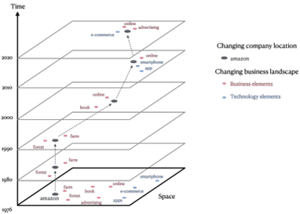
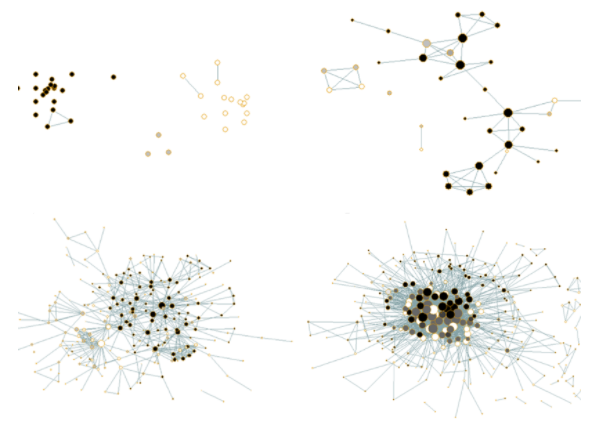

High Order Innovation and New Venture Success
-----
In this project, we use dynamic word embeddings and other NLP techniques to trace the change of business environment for U.S. companies in the past 45 years. We use over 100 business publications and patent corpus to build a model for the dynamic business landscape, which contains rich information about potential commercial opportunities and relational business concepts. The outcome is a multi-slice embedding space, with each slice reflects the underlying economic reality and Zeitgeist of the time.

By placing industries and individual organizations in this context, we build rich measures to evaluate their combinatorial novelty and potentials for future success. Our method helps us break the assumption of a static, ahistorical market, and help locate readers in the historical contexts where an entrepreneur makes her business decisions. Through the computational lens, we trace the complexities in business evolution.

{:height="200px" width="200px"}{:height="200px" width="200px"}

Revelant Work in Progress:

Cao, L., Chen, Z., & Evans, J. Novelty and New Venture Success. Drafting.

Cao, L., Chen, Z., & Evans, J. The Paradox of Innovation Science. [Title changed for blind review]

Evolution of Venture Capital Networks in China
------
In this project, we use ERGM and other models in SNA (social network analysis) to explore the pattern of network evolution in Chinese Venture Capital (VC) industry. We are interested in (1) how do VC firms choose their partners? And (2) how does this choice influence their long-term development?

This is a team project with researchers from Tsinghua University.

{:height="150px" width="200px"}{:height="150px" width="200px"}

Revelant publications:

Zheng, L., Cao, L., Ren, J., Li, X., Yin, X., & Chen, J. (2022). How venture capital firms choose syndication partners: the moderating effects of institutional uncertainty and investment preference, Management and Organization Review, 18(3), 463-490. 

Luo, J., Cao, L., & Guo, R. (2018). The embeddedness of syndication in Chinese venture capital, Jiangsu Social Sciences, 229(4), 85-96. (in Chinese)